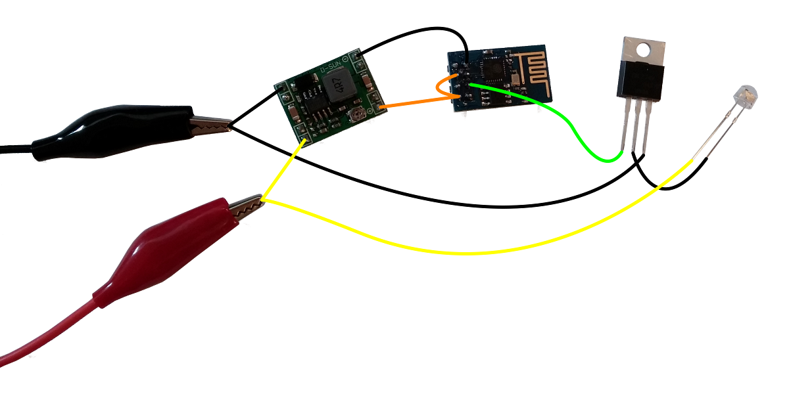

# NodeMCU PWM LED dimmer

Control the brightness of an LED (or LED strip) using an ESP8266 board (like the ESP-01) running NodeMCU. The duty cycle of a PWM signal (on pin 3) regulates the brightness. A minimal HTTP server offers a simple HTML form for sending the target duty cycle value via a GET request. The duty cycle slowly ramps up or down to fade between different levels of brightness.

A logic level MOSFET or other type of transistor (according to the needs of the specific LED installation) is connected to pin 3. A step-down converter might be necessary if the ESP8266 board and LED lighting are powered by a power supply with a higher voltage. An example using an ESP-01 (together with a step-down converter and a MOSFET) is shown in the following schematic image.

This project was inspired by:
* https://github.com/nodemcu/nodemcu-firmware/blob/master/lua_examples/webap_toggle_pin.lua
* http://blog.quindorian.org/2015/01/esp8266-wifi-led-dimmer-part-3-of-x.html
